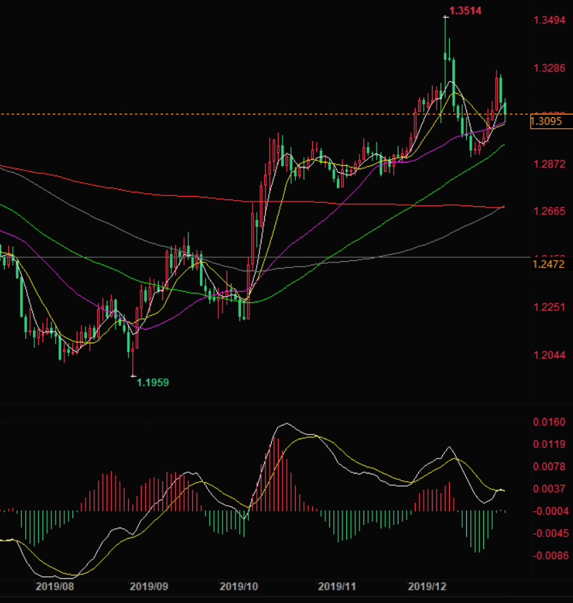
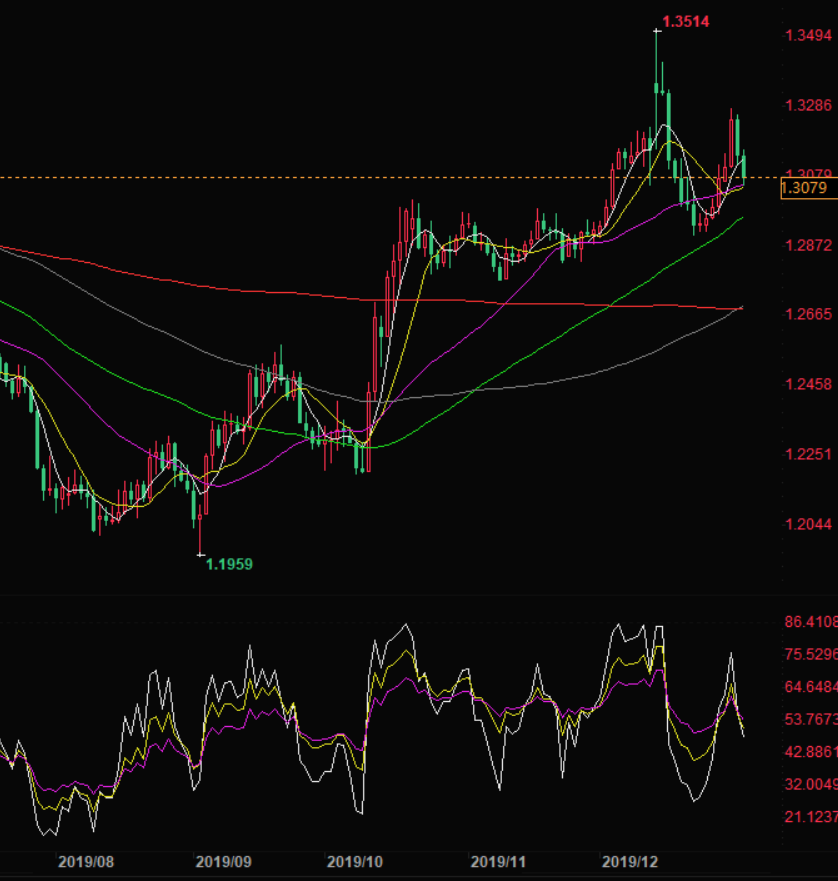

# 20200104 GBPUSD - HOLD

## Notes

See 'Day' row to decide whether to buy/sell/hold.

If buy/sell, zoom in to 5m/1h.

## Technical Analysis

Diagram | MACD | RSI | Candlestick | Est. Buy/Sell Date | Remark
:-:|-|-|-|-|-|-
5m |
1h |
4h |
Day | Up 3 Done. 3rd lower than 2nd - going down.   White not crossing yellow completely yet, wait for candlestick to match. | Start at 201908, peak at 201910, downward movement not yet completed. Wait for candlestick to match. | Up 6, down 2 | Buy next Fri, 20200110 | Hold
Week |
Month |

## MACD (DAY)

## RSI (DAY)

