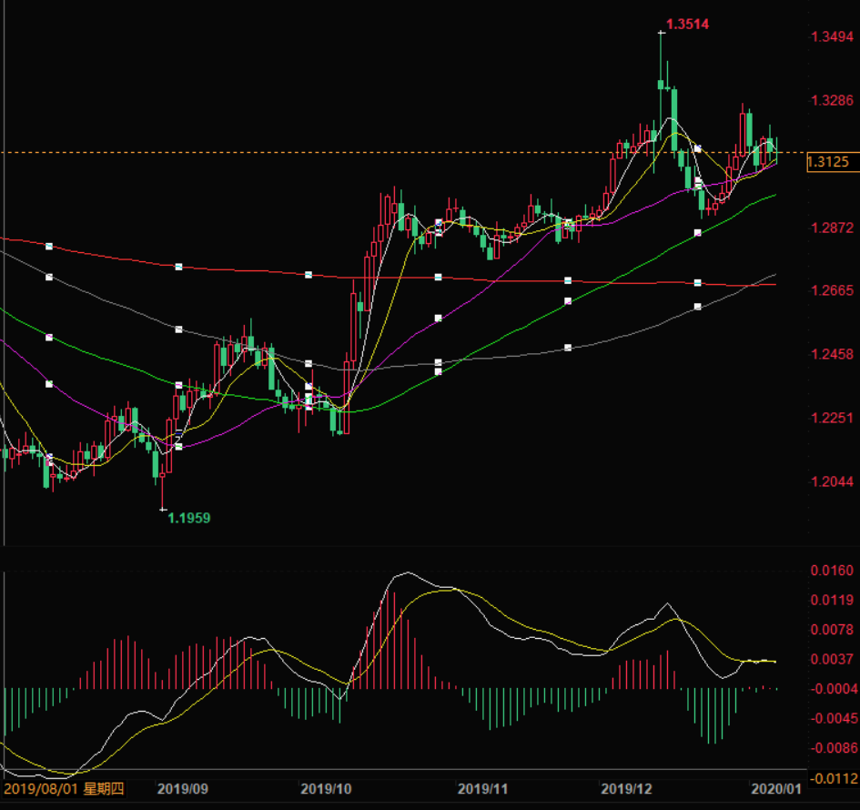
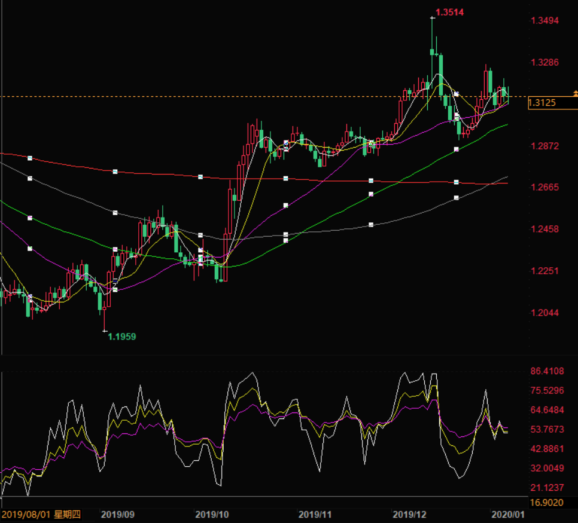

# 20200104 GBPUSD - HOLD

## Notes

See 'Day' row to decide whether to buy/sell/hold.

If buy/sell, zoom in to 5m/1h.

Was wrong on 20200104. Up 6 was already offset. Should have started with up 2.

Need to decide entry based on MACD, whether the white line is really crossing the yellow line. As of 2235hrs, 20200108, they are still tangled. 不出手买英镑还有一个重要原因，就是最近一周的振幅获利可能不到 1%... 算了一下，还挣不了 10 美元。

## Technical Analysis

Diagram | MACD | RSI | Candlestick | Est. Buy/Sell Date | Remark
:-:|-|-|-|-|-
5m |||||
1h |||||
4h |||||
Day | Adjusting. White line tangled with yellow line. No clear direction. | Adjusting. White and yellow are tangled and below purple. No clear direction. | Down 3, up 1. Today not counted. | Not clear. | Hold
Week |||||
Month |||||

## MACD (DAY)

## RSI (DAY)

