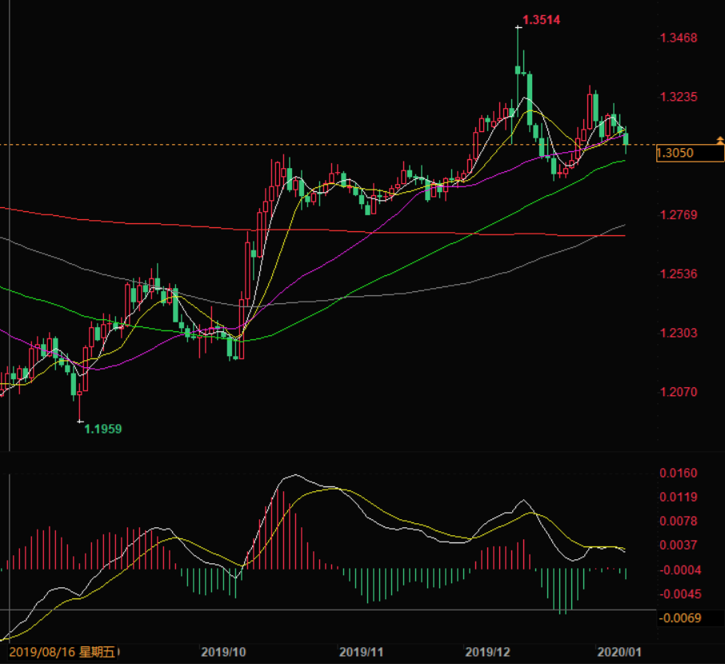
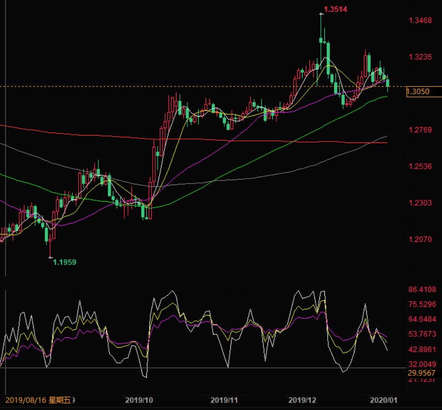

# 20200109 GBPUSD - HOLD

## Notes

还是看错了。

第一波行情始于 2019 年 8 月 16 日（周五），终于 2019 年 10 月 10 日（周四）。

第二波行情始于 2019 年 10 月 10 日（周四），终于 2019 年 12 月 3 日（周二）。

第三波行情始于 2019 年 12 月 3 日（周二），终于 2019 年 12 月 31 日（周二）。

三波之后，MACD 的白线和黄线一直纠缠，未见行情。之前判断跌到 1.29 就可以买进，现在看来并没有技术分析的依据，更多是出于基本面的判断。

从 K 线图看，应该再跌两天。跟之前的预判一致，因为 2020 年 1 月 6 日升了一天，跌势要往后延两天（一天升了，一天跌了，相互抵消）。

预计下周二有明确趋势（上涨或下跌）。

## Technical Analysis

Diagram | MACD | RSI | Candlestick | Est. Buy/Sell Date | Remark
:-:|-|-|-|-|-
5m |||||
1h |||||
4h |||||
Day | Adjusting. White line tangled with yellow line. No clear direction. | Adjusting. White and yellow are tangled and below purple. No clear direction. | Up 7, down 5. | Not clear. | Hold
Week |||||
Month |||||

## MACD (DAY)

## RSI (DAY)

